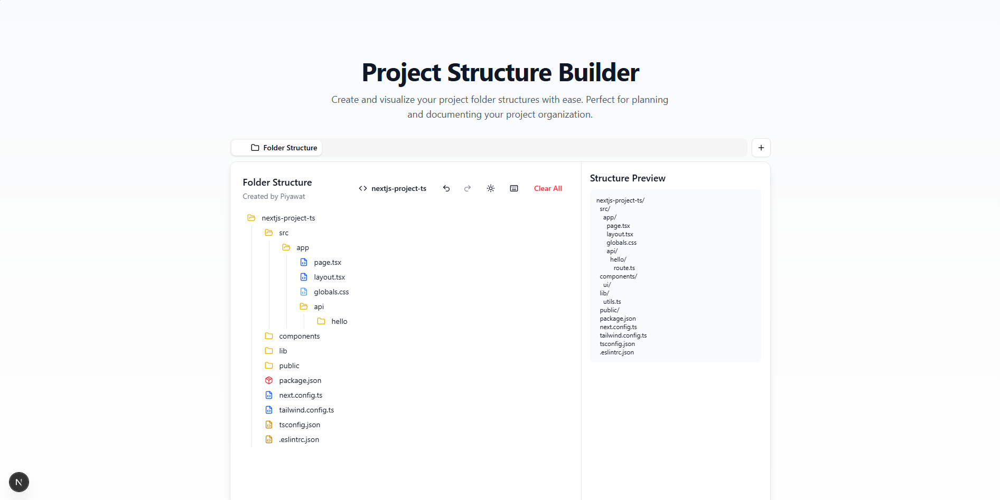

# 📁 Folder Structure Generator

A modern, interactive web application for creating and visualizing project folder structures. Built with Next.js and Tailwind CSS.



## ✨ Features

- 🌳 Visual folder structure creation and management
- 🎯 Drag-and-drop interface for moving items and tabs
- 🔄 Undo / Redo support
- ⌨️ Keyboard shortcuts for quick actions
- 📦 Multi-select and batch actions
- ✏️ Rename items and tabs via double-click
- 💬 Comment on folders or files for better collaboration or reminders
- 🧠 Intelligent folder nesting via drag-and-drop
- 📋 Copy, cut, paste, and delete operations
- 📤 Export structures as JSON, tree format, ZIP, or folder
- 📥 Import existing structures
- 🌓 Light/Dark mode support
- 💾 Auto-save functionality
- 🔄 Real-time structure preview
- 🎁 Framework-specific templates with custom options
- 📱 Responsive design with horizontal scrolling tabs

## 🎁 Supported Frameworks

Generate instant project structures for popular frameworks:

- Next.js
- React
- Vue
- Angular
- Svelte
- Nuxt
- Remix
- Astro
- FastAPI
- FastAPI by Essonna

### Framework Options

Each framework template can be customized with the following options:

- **TypeScript** - Enable TypeScript support and configuration
- **Tailwind CSS** - Include Tailwind CSS setup and configuration
- **ESLint** - Add ESLint configuration for code quality

These options can be toggled in the framework selection dropdown menu, allowing you to customize your project structure based on your needs.

Each framework template includes:

- Standard project layout
- Essential configuration files
- Common directories (components, pages, etc.)
- Framework-specific files and folders
- Optional TypeScript, Tailwind CSS, and ESLint configurations

## 📤 Export Options

The application supports multiple export formats:

1. **JSON Format**

   - Machine-readable format
   - Perfect for importing into other tools
   - Preserves all structure metadata

2. **Tree Format**

   - Visual tree representation
   - Easy to read and share
   - Shows hierarchical relationships

3. **Directory Format**

   - Simple text-based format
   - Shows folder/file hierarchy
   - Easy to copy and paste

4. **ZIP Download**

   - Downloads the structure as a ZIP file
   - Creates empty files and folders
   - Ready to use in your project

5. **Directory Download**
   - Downloads the structure as a folder
   - Creates actual files and folders
   - Perfect for starting a new project

## ⚙️ Interactions

### 🖱️ Item Management

- **Drag & Drop** — Move items into folders
- **Double Click** — Rename items
- **Multi-select** —
  - `Ctrl/Cmd + Click` to select/deselect individual items
  - `Ctrl/Cmd + A` to select all
  - `Esc` to clear selection
- **Keyboard Shortcuts**:
  - `⌘/Ctrl + C` — Copy
  - `⌘/Ctrl + X` — Cut
  - `⌘/Ctrl + V` — Paste
  - `Delete` — Delete

### 🗂️ Tab & Framework Handling

- **Drag & Drop (Tabs)** — Reorder framework tabs
- **Double Click (Tab)** — Rename tab
- **Click Framework Selector** — Pick or customize framework template
- **Customizable Options** — TypeScript, Tailwind CSS, ESLint, Import Alias

## ⚡ Keyboard Shortcuts

- `⌘/Ctrl + C` — Copy selected item
- `⌘/Ctrl + X` — Cut selected item
- `⌘/Ctrl + V` — Paste into selected folder
- `⌘/Ctrl + A` — Select all items
- `F2` — Rename selected item
- `Delete` — Delete selected item
- `Esc` — Deselect all

## 🚀 Getting Started

### Prerequisites

- Node.js 16.x or later
- npm or yarn

### Installation

1. Clone the repository:

```bash
git clone https://github.com/TiwKill/FolderStructureGenerator.git
cd FolderStructureGenerator/app/
```

2. Install dependencies:

```bash
npm install
# or
yarn install
```

3. Run the development server:

```bash
npm run dev
# or
yarn dev
```

4. Open [http://localhost:3000](http://localhost:3000) in your browser.

## 🛠️ Built With

- [Next.js](https://nextjs.org/) - React framework
- [Tailwind CSS](https://tailwindcss.com/) - CSS framework
- [shadcn/ui](https://ui.shadcn.com/) - UI components
- [Lucide Icons](https://lucide.dev/) - Icons
- [Sonner](https://sonner.emilkowal.ski/) - Toast notifications

## 📝 Usage

1. **Framework Selection:**

   - Click the framework selector in the toolbar
   - Choose your desired framework
   - The appropriate project structure will be generated automatically

2. **Creating Items:**

   - Click the "+" button to create a new folder or file
   - Right-click to access the context menu

3. **Managing Items:**

   - Select items by clicking
   - Use keyboard shortcuts for quick actions
   - Drag and drop to reorganize
   - Right-click → "Add Comment" to leave a note on any file/folder

4. **Exporting:**

   - Click the export button on any folder
   - Choose between JSON or tree structure format

5. **Importing:**

   - Click the import button
   - Select a JSON file with your structure

6. **Starting Fresh:**
   - Click "Clear All" to reset the structure
   - Select a new framework to start with a different template

## 👏 Acknowledgments

- [shadcn/ui](https://ui.shadcn.com/) for the beautiful UI components
- [Lucide](https://lucide.dev/) for the icons
- All contributors and users of this project

---

## 📋 Changelog

### 🆕 December 2025 - Code Organization Refactoring

**New Features:**

- ✅ Added **FastAPI** and **FastAPI by Essonna** framework templates
- ✅ Extracted reusable `usePreviewFormat` hook for better maintainability

**Code Improvements:**

- 📁 Reorganized constants from `components/constants/` to `src/constants/`
- 🧹 Removed unused `structureDisplay` and `treeViewDisplay` computed values
- 🧹 Removed redundant `formatTreeStructure` wrapper function
- 🔗 Consolidated dialog interfaces with `BaseDialogProps` pattern
- 📝 Changed non-component files from `.tsx` to `.ts` extension

**Dependencies Added:**

- `uuid` & `@types/uuid` - For unique ID generation
- `jszip` - For ZIP export functionality
